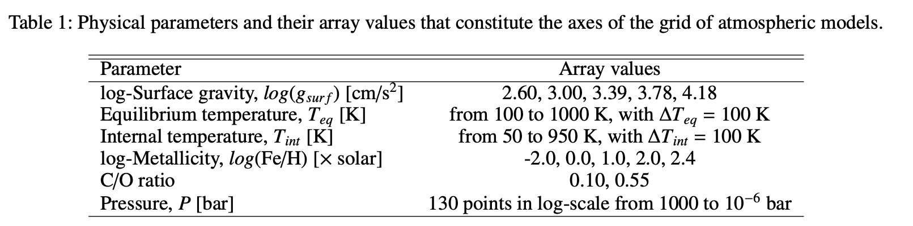

================
Atmospheric grid
================

.. note::

   Download the full notebook : :download:`here </_static/atm_grid.ipynb>`

In this section, we indicate the applicability range of the default atmospheric grid, as well as the possible error messages associated to the atmospheric grid and what they mean. Finally, if the default grid does not cover the parameter space that you need (i.e higher equilibrium temperatures, higher metallicity in the envelope) or you want to change the assumptions on the atmosphere (i.e include clouds), we explain how you can use your custom atmospheric grid with GASTLI.

Default grid
============

Applicability
-------------

The range of parameter values convered by the default grid of atmospheric models is indicated in the table below. The limiting log-metallicities correspond to an almost pure H/He envelope (0.01 x solar) to a 80% mass fraction in metals (250 x solar). The surface gravity of an interior-atmosphere model is not known a priori since it depends on the interior composition that is assumed. However, we can provide approximate estimates: for a log-surface gravity of 2.6 cgs, the mass is approximately 15-20 Earth masses, while a log-surface gravity of 4.18 cgs corresponds to planets between 5 and 6.5 Jupiter masses.  

   Table 1 in Acuña et al. Submitted, which shows the applicability of GASTLI's default atmospheric grid.

The atmospheric grid is interpolated using Python's ``scipy.interpolate.RegularGridInterpolator``, with the flags ``bounds_error=False`` and ``fill_value=None``. This means that if a parameter is outside of the atmospheric grid domain, extrapolation is performed. In that case, GASTLI will not stop the calculation, but it will display a message such as this: 

.. code-block:: language

   Surface gravity is out of atmospheric grid limits. Extrapolating

Troubleshooting
---------------

The default surface pressure in the atmospheric grid and the interior-atmosphere coupling is 1000 bar. However, such high pressure can be challenging for the convergence of some atmospheric models, especially at low surface gravities, high log-metallicities, and high internal temperatures. For these models, we fill the pressures between their maximum possible pressure (9.5 bar) and 1000 bar with ``np.nan``. This enables us to keep the atmospheric grid regular in 6 dimensions. Regular grids are faster to interpolate than irregular grids. If your interior-atmosphere model requires interpolating atmospheric models for which 9.5 bar is the maximum pressure, but you have the default surface pressure of 1000 bar, GASTLI will stop the computation and show the following message:

.. code-block:: language

   No atmospheric models available for this case (np.nan in grid).
   Decrease the interior temperature or decrease the surface pressure

If you try to run this same model without specifying ``P_surf``, the default of 1000 bar will be assumed, and the error above will be shown. Hence, we recommend to decrease the surface pressure by specifying it in the ``main()`` function of the coupling class. Example:

.. code-block:: python

   # Import coupling module
   import gastli.Coupling as cpl
   # Other Python modules
   import numpy as np
   # Create coupling class
   my_coupling = cpl.coupling(j_max=99, pow_law_formass=0.31)
   # Input for interior
   M_P = 50.
   # Internal and equilibrium temperatures
   Tintpl = 700.
   Teqpl = 1000.
   # Core mass fraction
   CMF = 0.5
   # Run model with P_surf at 9.5 bar
   my_coupling.main(M_P, CMF, Teqpl, Tintpl, CO=0.55, log_FeH=2.4,Rguess=6.,P_surf=9.5)

If you are running a thermal evolution class, you can specify at which surface pressures you want each of the model of the sequence to be calculated at. This is done by setting ``P_surf`` to an array of the same length as ``Tint_array`` in the ``main()`` function of the thermal evolution class.

.. important::

   If you are calculating a thermal sequence, our recommendation is to calculate the models at low internal temperature with     ``P_surf`` = 1000 bar (default), and the models at high internal temperature with ``P_surf=9.5`` bar. Do not calculate all models at 9.5 bar! At low temperatures, the entropy’s slope becomes flat with time, and makes it difficult to integrate the luminosity equation. Specify the surface pressure for each model as shown in the example below.

Here is an example:

.. code-block:: python

   # Import GASTLI thermal module
   import gastli.Thermal_evolution as therm
   import gastli.constants as cte
   # Other Python modules
   import numpy as np
   import matplotlib.pyplot as plt
   # Create thermal evolution class object
   my_therm_obj = therm.thermal_evolution()
   # Input for interior
   M_P = 100.     # Earth units
   # Equilibrium temperatures
   Teqpl = 700.
   # Core mass fraction
   CMF = 0.2
   log_FeH = 1.
   Tint_array = np.asarray([50., 100., 200., 300., 400., 500., 600., 700., 800.])
   # Specify the surface pressure of each model in the thermal sequence
   # Models with Tint=50 to 300 K have Psurf=1000 bar, while Tint=400 to 800 K have Psurf=9.5 bar
   P_surf_array = np.asarray([1e3, 1e3, 1e3, 1e3, 9.5, 9.5, 9.5, 9.5, 9.5])
   my_therm_obj.main(M_P, CMF, Teqpl, Tint_array, log_FeH=log_FeH,P_surf=P_surf_array)
   my_therm_obj.solve_thermal_evol_eq(t_Gyr=np.linspace(2.1e-6, 15., 10000))

   
How to use a custom grid
========================

To use a different atmospheric grid from the default, you must place the grid file in the ``gastli_input_data/Input/Atmospheric data`` directory. Then the name of the grid file must be specified when a coupling class object is initialised, or when the thermal class object main function is called, with the ``name_grid`` parameter:

.. code-block:: python

   my_coupling = cpl.coupling(name_grid="my_custom_grid.hdf5")

or 

.. code-block:: python

   my_therm_obj.main(M_P, CMF, Teqpl, Tint_array, log_FeH=log_FeH, name_grid="my_custom_grid.hdf5")

The file must be in hdf5 format. The file must have the following datasets:

- ``PT_profiles`` and ``metal_mass_fractions``: these contain the pressure-temperature profiles and the metal mass fraction profiles, respectively. They have 6 dimensions (in order): C/O, :math:`log(Fe/H)`, :math:`log(g)` (in cgs units), :math:`T_{eq}`, :math:`T_{int}` (in K) and pressure (in bar).
- The datasets that indicate the grids of the 6 dimensions: ``CO``, ``FeH``, ``Teq``, ``Tint``, ``logg``, ``pressure``.

An example snippet to create a grid with such format: 

.. code-block:: python

   # Import modules
   import numpy as np
   import h5py
   # Define arrays for grid
   COs = np.asarray([0.10,0.55])
   FeHs = np.asarray([-2.,0.,1.,2.,2.4])
   loggs = np.linspace(np.log10(400.0),np.log10(15000.0),num=5)
   Teqs = np.arange(100.,1100.,100)
   Tints = np.arange(50.,1000.,100)
   press_atm = np.logspace(-6, 3, 130) # note: all temperature profiles have the same pressure array 
   n_CO = len(COs)                     # this is the case for our petitcode grid (GASTLI's default for warm gas giants).
   n_FeH = len(FeHs)                   # This may not be the case for all libraries of atmospheric models
   n_logg = len(loggs)
   n_Teq = len(Teqs)
   n_Tint = len(Tints)
   n_PT = len(press_atm)
   # Create file
   f = h5py.File("my_custom_grid.hdf5", "w")
   # Create PT profile and metal mass fractions dataset
   data_set_temp = f.create_dataset("PT_profiles", (n_CO,n_FeH,n_logg,n_Teq,n_Tint,n_PT), dtype='f')
   data_set_mmf = f.create_dataset("metal_mass_fractions", (n_CO,n_FeH,n_logg,n_Teq,n_Tint,n_PT), dtype='f')
   # Assign labels to the dimensions
   f['PT_profiles'].dims[0].label = 'CO_ratio'
   f['PT_profiles'].dims[1].label = 'logFeH_xsolar'
   f['PT_profiles'].dims[2].label = 'loggsurf_cgs'
   f['PT_profiles'].dims[3].label = 'Teq_K'
   f['PT_profiles'].dims[4].label = 'Tint_K'
   f['PT_profiles'].dims[5].label = 'Press_bar'
   f['metal_mass_fractions'].dims[0].label = 'CO_ratio'
   f['metal_mass_fractions'].dims[1].label = 'logFeH_xsolar'
   f['metal_mass_fractions'].dims[2].label = 'loggsurf_cgs'
   f['metal_mass_fractions'].dims[3].label = 'Teq_K'
   f['metal_mass_fractions'].dims[4].label = 'Tint_K'
   f['metal_mass_fractions'].dims[5].label = 'Press_bar'
   # Create datasets for the grid arrays
   f['CO'] = COs
   f['FeH'] = FeHs
   f['logg'] = loggs
   f['Teq'] = Teqs
   f['Tint'] = Tints
   f['pressure'] = press_atm
   # Associate arrays as dimensions of grid dataset
   f['PT_profiles'].dims[0].attach_scale(f['CO'])
   f['PT_profiles'].dims[1].attach_scale(f['FeH'])
   f['PT_profiles'].dims[2].attach_scale(f['logg'])
   f['PT_profiles'].dims[3].attach_scale(f['Teq'])
   f['PT_profiles'].dims[4].attach_scale(f['Tint'])
   f['PT_profiles'].dims[5].attach_scale(f['pressure'])
   f['metal_mass_fractions'].dims[0].attach_scale(f['CO'])
   f['metal_mass_fractions'].dims[1].attach_scale(f['FeH'])
   f['metal_mass_fractions'].dims[2].attach_scale(f['logg'])
   f['metal_mass_fractions'].dims[3].attach_scale(f['Teq'])
   f['metal_mass_fractions'].dims[4].attach_scale(f['Tint'])
   f['metal_mass_fractions'].dims[5].attach_scale(f['pressure'])
   # Fill in empty grids with data
   for i_CO, CO in enumerate(COs):
       for i_FeH, FeH in enumerate(FeHs):
           for i_logg, logg in enumerate(loggs):
               for i_eq, Teq in enumerate(Teqs):
                   for i_int, Tint in enumerate(Tints):
                       # locate file with temperature profile
                       target_folder_path = 'PTcode models/'+folder_strings[i_CO][i_FeH]+'/run_folders/'+\
                                         header_strings[i_CO][i_FeH]+\
                                         '_log_'+str(np.round(logg,2))+'_Teq_' + str(np.round(Teq, 3))+'_Tint_' +\
                                         str(np.round(Tint, 3))
                       
                       # read file with temperature and MMF profiles               
                       data = pd.read_csv(target_folder_path + "/res_files/it_files/res_struct_curr.dat", sep='\s+',\
                                           header=None, skiprows=2)
                        
                       temp = data[1]
                       mmf_prof = data[2]

                       data_set_temp[i_CO, i_FeH, i_logg, i_eq, i_int, :] = data[1]
                       data_set_mmf[i_CO, i_FeH, i_logg, i_eq, i_int, :] = data[2]
   f.close() 

