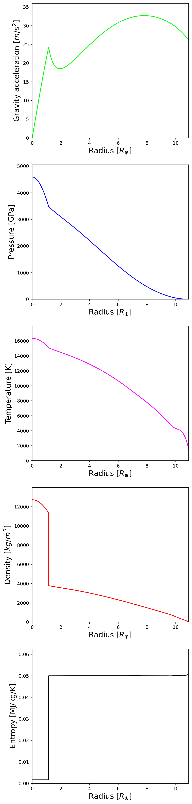
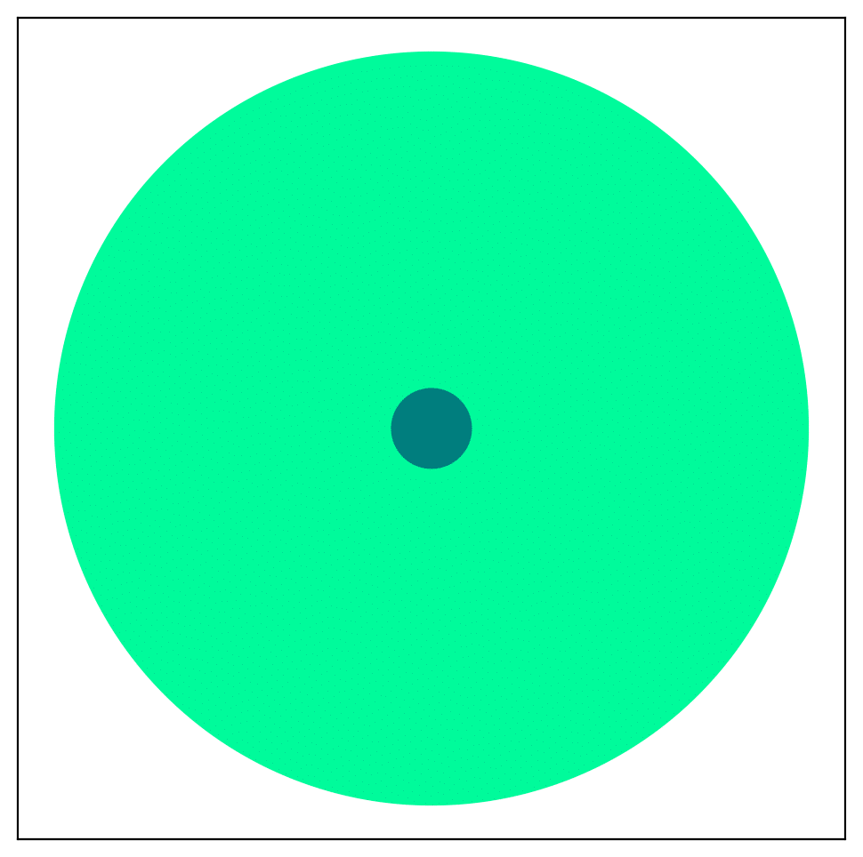
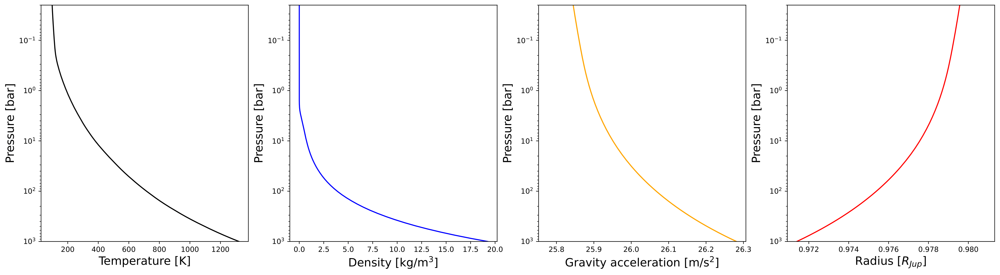
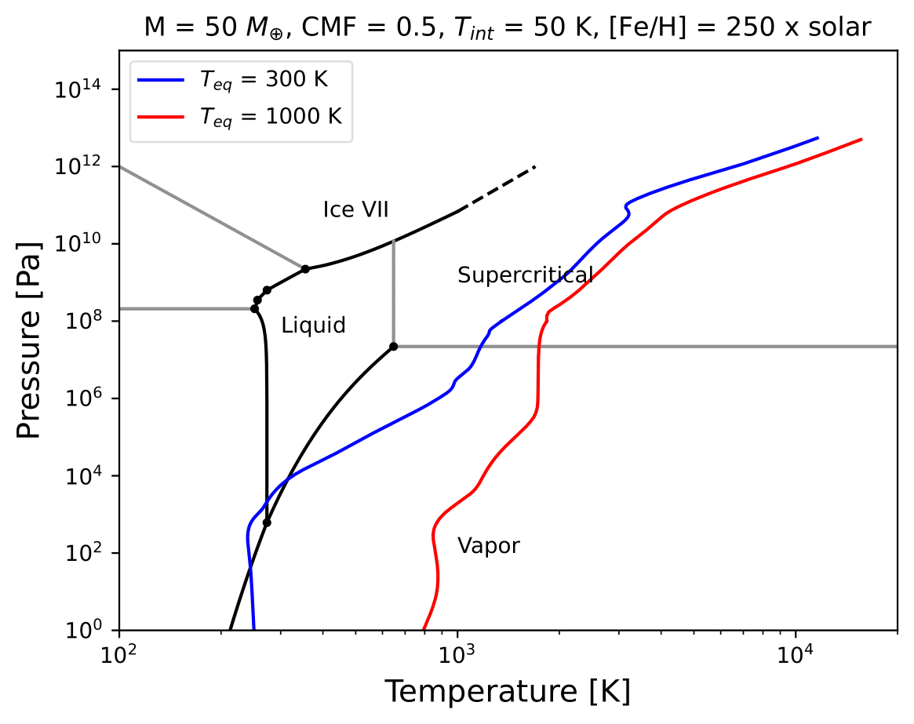
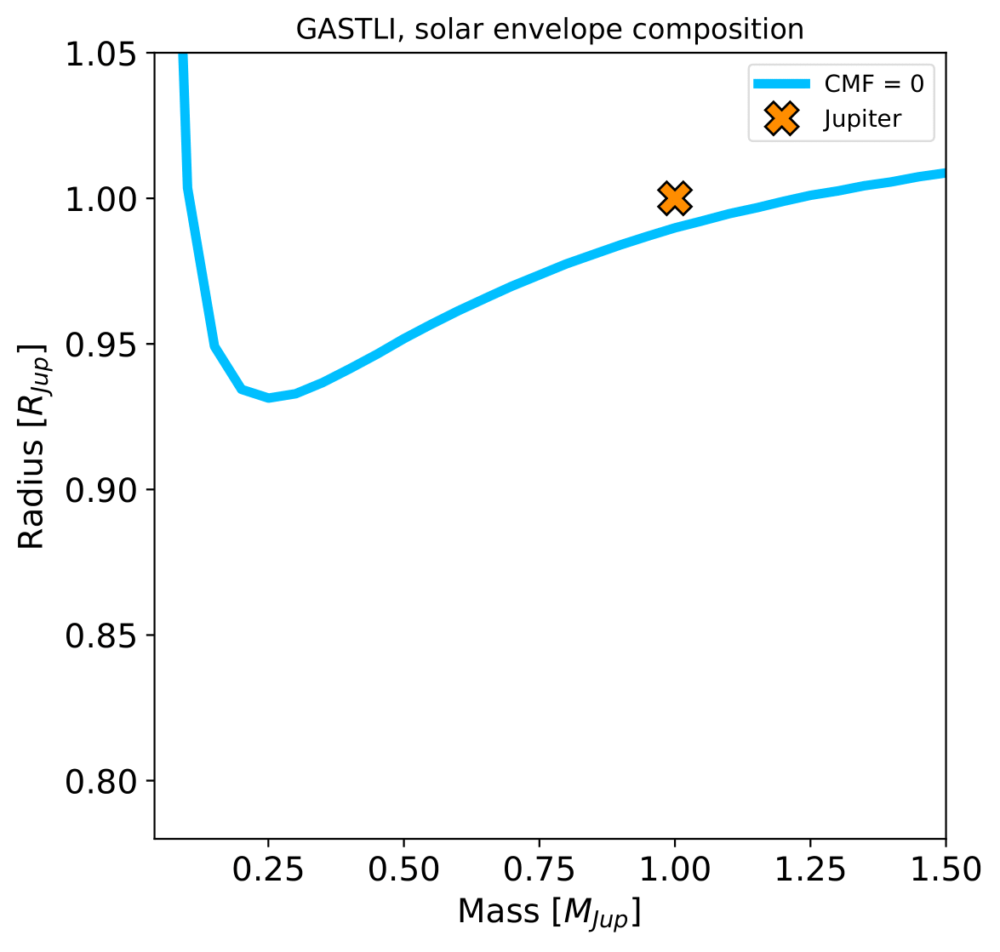

Creating an interior-atmosphere object
======================================

.. note::

   Download the full notebook : :download:`here </_static/int_atm_object.ipynb>`

You can start a simple interior-atmosphere object to generate one model by initialising the ``coupling`` class:

.. code-block:: python

   # Import coupling module
   import gastli.Coupling as cpl
   # Other Python modules
   import numpy as np
   # Initialise coupling class
   my_coupling = cpl.coupling()

Next, specify the input variables for the interior-atmosphere model:

.. code-block:: python

   # Input for interior
   # 1 Mjup in Mearth units
   M_P = 318.
   # Internal temperature
   Tintpl = 99.
   # Equilibrium temperature
   Teqpl = 122.
   # Core mass fraction
   CMF = 0.01

If the log-metallicity of the atmosphere, :math:`log(Fe/H)`, is known, you must specify it as:

.. code-block:: python

   # Envelope log-metallicity is solar
   log_FeHpl = 0
   # C/O ratio is solar
   CO_planet = 0.55
   # Run coupled interior-atmosphere model
   my_coupling.main(M_P, CMF, Teqpl, Tintpl, CO=CO_planet, log_FeH=log_FeHpl)

In a nutshell, you can print the output radius, total metal content, surface gravity, etc:

.. code-block:: python

   print("Case 1, log(Fe/H) is known")
   # Composition input
   print("log(Fe/H) atm [x solar] (input) = ",my_coupling.myatmmodel.log_FeH)
   print("C/O atm (input) = ",my_coupling.myatmmodel.CO)
   # Output
   print("Zenv (output) = ",my_coupling.myatmmodel.Zenv_pl)
   print("Total planet mass M [M_earth] = ",my_coupling.Mtot)
   print("Temperature at 1000 bar [K] = ",my_coupling.T_surf)
   print("Planet bulk radius [R_jup] = ",my_coupling.Rbulk_Rjup)
   print("log10_g: Planet surface gravity (1000 bar) [cm/s2] = ",np.log10(my_coupling.g_surf_planet))
   print("Total planet radius [R_jup] = ",my_coupling.Rtot)
   tmm = my_coupling.Mtot*CMF + my_coupling.Mtot*(1-CMF)*my_coupling.myatmmodel.Zenv_pl
   print("Total metal mass [M_earth] = ",tmm)

   
You will obtain the following output:

.. code-block:: language

   Case 1, log(Fe/H) is known
   log(Fe/H) atm [x solar] (input) =  0
   C/O atm (input) =  0.55
   Zenv (output) =  0.013532983488449907
   Total planet mass M [M_earth] =  318.0389824070297
   Temperature at 1000 bar [K] =  1321.0792698333128
   Planet bulk radius [R_jup] =  0.9732321589894197
   log10_g: Planet surface gravity (1000 bar) [cm/s2] =  3.417144909504209
   Total planet radius [R_jup] =  0.9795696861509946
   Total metal mass [M_earth] =  7.441365958692064

On the other hand, if the envelope metal mass fraction is known instead of the log-metallicity, :math:`Z_{env}`, the flag ``FeH_flag=False`` must be used:

.. code-block:: python

   # Envelope metal mass fraction 
   Zenvpl = 0.013
   # Run coupled interior-atmosphere model
   my_coupling.main(M_P, CMF, Teqpl, Tintpl, FeH_flag=False, CO=CO_planet, Zenv=Zenvpl)

With its respective output summary:

.. code-block:: language

   Zenv (input) =  0.013
   C/O atm (input) =  0.55
   log(Fe/H) atm [x solar] (output) =  0.3130236027986046
   Total planet mass M [M_earth] =  318.0393440504418
   Temperature at 1000 bar [K] =  1358.2228909481744
   Planet bulk radius [R_jup] =  0.9754815399424
   log10_g: Planet surface gravity (1000 bar) [cm/s2] =  3.4151397013097373
   Total planet radius [R_jup] =  0.9821050130682911
   Total metal mass [M_earth] =  7.273559798433604

Interior structure profiles
---------------------------------------

To plot the interior structure profiles, we can obtain the arrays from the interior-atmosphere coupling class as:

- **Gravity** in m/s :sup:`2`: ``coupling_class_object.myplanet.g``
- **Pressure** in Pa: ``coupling_class_object.myplanet.P``
- **Temperature** in K: ``coupling_class_object.myplanet.T``
- **Density** in kg/m :sup:`3`: ``coupling_class_object.myplanet.rho``
- **Entropy** in J/kg/K: ``coupling_class_object.myplanet.entropy``
- **Radius** in m: ``coupling_class_object.myplanet.r``

Following the Jupiter example above (case 1, when the log-metallicity is known), the coupling class object was named ``my_coupling``. We would add the following code to plot the 5 interior profiles as a function of radius: 

.. code-block:: python

   # more modules
   import gastli.constants as cte
   import matplotlib.pyplot as plt
   # Jupiter radius in Earth radii
   Rjup_Rearth = 11.2
   xmax = Rjup_Rearth*my_coupling.Rbulk_Rjup
   # Plot interior profiles
   fig = plt.figure(figsize=(6, 30))
   # Panel 1: gravity
   ax = fig.add_subplot(5, 1, 1)
   plt.plot(my_coupling.myplanet.r / cte.constants.r_e, my_coupling.myplanet.g, '-', color='lime')
   plt.xlabel(r'Radius [$R_{\oplus}$]', fontsize=16)
   plt.ylabel(r'Gravity acceleration [$m/s^{2}$]', fontsize=16)
   plt.xlim(0, xmax)
   plt.ylim(0, 1.1 * np.nanmax(my_coupling.myplanet.g))
   # Panel 2: pressure
   ax = fig.add_subplot(5, 1, 2)
   plt.plot(my_coupling.myplanet.r / cte.constants.r_e, my_coupling.myplanet.P / 1e9, '-', color='blue')
   plt.xlabel(r'Radius [$R_{\oplus}$]', fontsize=16)
   plt.ylabel('Pressure [GPa]', fontsize=16)
   plt.xlim(0, xmax)
   plt.ylim(0, 1.1 * np.amax(my_coupling.myplanet.P / 1e9))
   # Panel 3: temperature
   ax = fig.add_subplot(5, 1, 3)
   plt.plot(my_coupling.myplanet.r / cte.constants.r_e, my_coupling.myplanet.T, '-', color='magenta')
   plt.xlabel(r'Radius [$R_{\oplus}$]', fontsize=16)
   plt.ylabel('Temperature [K]', fontsize=16)
   plt.xlim(0, xmax)
   plt.ylim(0, 1.1 * np.amax(my_coupling.myplanet.T))
   # Panel 4: density
   ax = fig.add_subplot(5, 1, 4)
   plt.plot(my_coupling.myplanet.r / cte.constants.r_e, my_coupling.myplanet.rho, '-', color='red')
   plt.xlabel(r'Radius [$R_{\oplus}$]', fontsize=16)
   plt.ylabel(r'Density [$kg/m^{3}$]', fontsize=16)
   plt.xlim(0, xmax)
   plt.ylim(0, 1.1 * np.nanmax(my_coupling.myplanet.rho))
   # Panel 5: entropy
   ax = fig.add_subplot(5, 1, 5)
   plt.plot(my_coupling.myplanet.r / cte.constants.r_e, my_coupling.myplanet.entropy/1e6, '-', color='black')
   plt.xlabel(r'Radius [$R_{\oplus}$]', fontsize=16)
   plt.ylabel(r'Entropy [MJ/kg/K]', fontsize=16)
   plt.xlim(0, xmax)
   plt.ylim(0, 1.1 * np.nanmax(my_coupling.myplanet.entropy/1e6))
   # Save figure
   fig.savefig('interior_structure_profiles.pdf', bbox_inches='tight', format='pdf', dpi=1000)
   plt.close(fig)

   Interior structure profiles for a Jupiter analog with GASTLI.

Additionally, we can show with a circle diagram the size of the core with respect to the size of the planet from the center up to 1000 bar (default interior-atmosphere boundary). For this diagram, the radii at which the core-envelope boundary and the outer envelope interface are located is obtained with the radius profile array (``coupling_class_object.myplanet.r``), and an array named ``coupling_class_object.myplanet.intrf``, which indicates the indexes of the interior profile arrays that correspond to the interfaces between the different layers. Element ``i = 1`` of this array corresponds to the core-envelope interfaces, while element ``i = 2`` is the outer (surface) boundary of the envelope. Since the indexing follows the Fortran convention, the final Python index is the original index minus 1 (see example below):

.. code-block:: python

   # Plot planet core and envelope
   fig = plt.figure(figsize=(6, 6))
   ax = fig.add_subplot(1, 1, 1)
   # Core radius
   r_core = my_coupling.myplanet.r[my_coupling.myplanet.intrf[1] - 1]\
         / my_coupling.myplanet.r[my_coupling.myplanet.intrf[2] - 1]
   # Interior-atmosphere boundary
   r_lm = my_coupling.myplanet.r[my_coupling.myplanet.intrf[2] - 1]\
       / my_coupling.myplanet.r[my_coupling.myplanet.intrf[2] - 1]
   # Circles
   circle4 = plt.Circle((0.5, 0.5), r_core, color='teal')
   circle3 = plt.Circle((0.5, 0.5), r_lm, color='mediumspringgreen')
   ax.add_patch(circle3)
   ax.add_patch(circle4)
   plt.tick_params(axis='both', which='both', bottom=False, top=False, \
                labelbottom=False, right=False, left=False, labelleft=False)
   plt.axis('equal')
   # Save figure
   fig.savefig('core_and_envelope.pdf', bbox_inches='tight', format='pdf', dpi=1000)
   plt.close(fig)

   Size of core in comparison to planet size (interior only).

Atmospheric profiles
--------------------------------

Similar to the interior structure profiles, the atmospheric profiles can be obtained as: 

- **Gravity** in m/s :sup:`2`: ``coupling_class_object.myatmmodel.g_ode``
- **Pressure** in Pa: ``coupling_class_object.myatmmodel.P_ode``
- **Temperature** in K: ``coupling_class_object.myatmmodel.T_ode``
- **Density** in kg/m :sup:`3`: ``coupling_class_object.myatmmodel.rho_ode``
- **Radius** in m: ``coupling_class_object.myatmmodel.r_ode``

Following the example above, we can plot the atmospheric profiles as (the coupling class object is still ``my_coupling``):

.. code-block:: python

   # Plot atm. profiles
   fig = plt.figure(figsize=(24, 6))
   # Panel 1: temperature
   ax = fig.add_subplot(1, 4, 1)
   plt.plot(my_coupling.myatmmodel.T_ode,my_coupling.myatmmodel.P_ode/1e5, '-', color='black')
   plt.ylabel(r'Pressure [bar]', fontsize=16)
   plt.xlabel(r'Temperature [K]', fontsize=16)
   ax.invert_yaxis()
   ax.set_yscale('log')
   plt.ylim(1e3,2e-2)
   # Panel 2: density
   ax = fig.add_subplot(1, 4, 2)
   plt.plot(my_coupling.myatmmodel.rho_ode,my_coupling.myatmmodel.P_ode/1e5, '-', color='blue')
   plt.ylabel(r'Pressure [bar]', fontsize=16)
   plt.xlabel(r'Density [kg/m$^{3}$]', fontsize=16)
   ax.invert_yaxis()
   ax.set_yscale('log')
   plt.ylim(1e3,2e-2)
   # Panel 3: gravity
   ax = fig.add_subplot(1, 4, 3)
   plt.plot(my_coupling.myatmmodel.g_ode,my_coupling.myatmmodel.P_ode/1e5, '-', color='orange')
   plt.ylabel(r'Pressure [bar]', fontsize=16)
   plt.xlabel('Gravity acceleration [m/s$^{2}$]', fontsize=16)
   ax.invert_yaxis()
   ax.set_yscale('log')
   plt.ylim(1e3,2e-2)
   # Panel 4: pressure and radius
   ax = fig.add_subplot(1, 4, 4)
   # Rjup = 7.149e7    # Jupiter radius in m
   plt.plot(my_coupling.myatmmodel.r/7.149e7,my_coupling.myatmmodel.P_ode/1e5, '-', color='red')
   plt.ylabel(r'Pressure [bar]', fontsize=16)
   plt.xlabel('Radius [$R_{Jup}$]', fontsize=16)
   ax.invert_yaxis()
   ax.set_yscale('log')
   plt.ylim(1e3,2e-2)
   # Save figure
   fig.savefig('atmospheric_profiles.pdf', bbox_inches='tight', format='pdf', dpi=1000)
   plt.close(fig)

   Atmospheric profiles for Jupiter analogue with GASTLI's default atmospheric grid.

.. note::

  In the following example, we make use of the optional input parameter ``Rguess``. This is the initial guess of the planet radius for the interior-atmosphere algorithm. The default value is Jupiter's radius (11.2 Earth radii), but for smaller planets (lower mass and/or higher metal content) using a lower value of ``Rguess`` than the default speeds convergence.

We can combine the pressure-temperature profile from the interior and the atmosphere to obtain the complete adiabat. We can use the GASTLI class ``water_curves`` to overplot the water phase diagram to see if water condensation occurs in the upper layers of the atmosphere:

.. code-block:: python

   # Import GASTLI modules
   import gastli.water_curves as water_curv
   import gastli.Coupling as cpl
   # Other modules
   from matplotlib import pyplot as plt
   import numpy as np
   # Cold planet model
   my_coupling = cpl.coupling()
   # Input for interior
   # Mearth units
   M_P = 50.
   # Internal temperature
   Tintpl = 50.
   # Equilibrium temperature
   Teqpl = 300.
   # Core mass fraction
   CMF = 0.5
   # Envelope log-metallicity is solar
   log_FeHpl = 2.4
   # C/O ratio is solar
   CO_planet = 0.55
   # Run coupled interior-atmosphere model
   my_coupling.main(M_P, CMF, Teqpl, Tintpl, CO=CO_planet, log_FeH=log_FeHpl,Rguess=6.)
   # Hot planet model
   my_coupling_hot = cpl.coupling()
   my_coupling_hot.main(M_P, CMF, 1000., Tintpl, CO=CO_planet, log_FeH=log_FeHpl,Rguess=6.)
   # Water phase diagram class
   water_phase_lines = water_curv.water_curves()
   # Plot
   fig,ax = plt.subplots(nrows=1,ncols=1)
   plt.title(r'M = 50 $M_{\oplus}$, CMF = 0.5, $T_{int}$ = 50 K, [Fe/H] = 250 x solar')
   water_phase_lines.plot_water_curves(ax)
   plt.plot(my_coupling.myplanet.T, my_coupling.myplanet.P, '-', color='blue',label=r'$T_{eq}$ = 300 K')
   plt.plot(my_coupling.myatmmodel.T_ode, my_coupling.myatmmodel.P_ode, '-', color='blue')
   plt.plot(my_coupling_hot.myplanet.T, my_coupling_hot.myplanet.P, '-', color='red',label='$T_{eq}$ = 1000 K')
   plt.plot(my_coupling_hot.myatmmodel.T_ode, my_coupling_hot.myatmmodel.P_ode, '-', color='red')
   plt.yscale('log')
   plt.xscale('log')
   plt.ylabel(r'Pressure [Pa]', fontsize=14)
   plt.xlabel(r'Temperature [K]',fontsize=14)
   xmin = 100
   xmax = 2e4
   plt.xlim((xmin,xmax))
   plt.ylim((1,1e15))
   plt.text(1000, 1e9, 'Supercritical')
   plt.text(400, 5e10, 'Ice VII')
   plt.text(300, 5e7, 'Liquid')
   plt.text(1000, 100, 'Vapor')
   plt.legend()
   # Save figure
   fig.savefig('phase_diagram.pdf',bbox_inches='tight',format='pdf', dpi=1000)
   plt.close(fig)

   Pressure-temperature adiabats for a metal-rich planet at low (300 K) and high irradiation (1000 K).
   Water condenses in the upper layers of the atmosphere in the cold planet case.

Mass-radius diagram
---------------------------------

To generate a mass-radius curve, you need to call the coupling class several times, and modify the mass in each call. A ``for`` loop can do this: 

.. code-block:: python

   # Import coupling module
   import gastli.Coupling as cpl
   # Other Python modules
   import numpy as np
   # Input for interior
   ## 1 Mjup in Mearth units
   Mjup = 318.
   mass_array = Mjup * np.arange(0.05,1.6,0.05)
   n_mrel = len(mass_array)
   ## Internal temperature 
   Tintpl = 107.     # K
   ## Equilibrium temperature
   Tstar = 5777.     # K
   Rstar = 0.00465   # AU
   ad = 5.2          # AU
   Teq_4 = Tstar**4./4. * (Rstar/ad)**2.
   Teqpl = Teq_4**0.25
   # Core mass fraction
   CMF = 0.
   # Mass-radius curve output file
   file_out = open('Jupiter_MRrel_CMF0_logFeH_0.dat','w')
   file_out.write('  M_int[M_E]  M_tot[M_E]  x_core  ')
   file_out.write('T_surf[K]  R_bulk[R_J]  R_tot[R_J]  T_int[K]  Zenv  z_atm[R_J] ')
   file_out.write("\n")
   # For loop that changes the mass in each call of the coupling class
   for k in range(0, n_mrel):
       M_P_model = mass_array[k]
       print('---------------')
       print('Mass [Mearth] = ', M_P_model)
       print('Model = ', k+1, ' out of ', n_mrel)
       print('---------------')
       # Create coupling class (this also resets parameters)
       my_coupling = cpl.coupling(pow_law_formass=0.31)
       # Case 1, log(Fe/H) is known
       # You must have FeH_flag=True, which is the default value
       my_coupling.main(M_P_model, CMF, Teqpl, Tintpl, CO=0.55, log_FeH=0.)
       # Save data
       file_out.write('%s %s' % ("  ", str(M_P_model)))
       file_out.write('%s %s' % ("  ", str(my_coupling.Mtot)))
       file_out.write('%s %s' % ("  ", str(CMF)))
       file_out.write('%s %s' % ("  ", str(my_coupling.T_surf)))
       file_out.write('%s %s' % ("  ", str(my_coupling.Rbulk_Rjup)))
       file_out.write('%s %s' % ("  ", str(my_coupling.Rtot)))
       file_out.write('%s %s' % ("  ", str(Tintpl)))
       file_out.write('%s %s' % ("  ", str(my_coupling.myatmmodel.Zenv_pl)))
       zatm_RJ = my_coupling.Rtot - my_coupling.Rbulk_Rjup
       file_out.write('%s %s' % ("  ", str(zatm_RJ)))
       file_out.write("\n")
       file_out.flush()
   # End of for loops
   file_out.close()

We can then read the file and plot the mass-radius curve. In this file, the columns ``M_tot[M_E]`` and ``R_tot[R_J]`` are the total mass and radius in Earth masses and Jupiter radii units, respectively. We can plot them as: 

.. code-block:: python

   # Import modules
   import matplotlib.pyplot as plt
   import numpy as np
   import pandas as pd
   # Read data from file
   data = pd.read_csv('Jupiter_MRrel_CMF0_logFeH_0.dat', sep='\s+',header=0)
   M_CMF0_logFeH0_Tint107 = data['M_tot[M_E]']
   R_CMF0_logFeH0_Tint107 = data['R_tot[R_J]']
   # Mass-radius plot
   xmin = 0.04
   xmax = 1.50
   ymin = 0.78
   ymax = 1.05
   Mjup = 318.
   fig = plt.figure(figsize=(6,6))
   ax = fig.add_subplot(1, 1, 1)
   ax.tick_params(axis='both', which='major', labelsize=14)
   plt.title("GASTLI, solar envelope composition")
   plt.plot(M_CMF0_logFeH0_Tint107/Mjup, R_CMF0_logFeH0_Tint107, color='black',linestyle='solid',\
         linewidth=4, label=r'CMF = 0')
   # Jupiter ref
   plt.plot([1.], [1.], 'X', color='darkorange',label=r'Jupiter',markersize=14,\
         markeredgecolor='black')
   plt.xlim((xmin,xmax))
   plt.ylim((ymin,ymax))
   plt.xlabel(r'Mass [$M_{Jup}$]',fontsize=14)
   plt.ylabel(r'Radius [$R_{Jup}$]',fontsize=14)
   plt.legend()
   fig.savefig('Jupiter_MRrel.pdf',bbox_inches='tight',format='pdf', dpi=1000)
   plt.close(fig)

   Mass-radius curve for a Jupiter analogue with a homogeneous, solar composition (CMF = 0, log(Fe/H) = 0).

