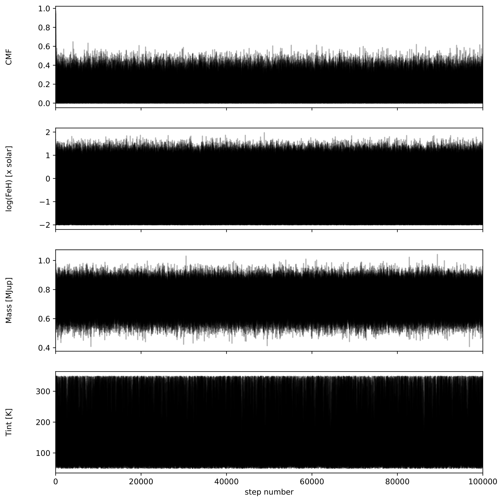
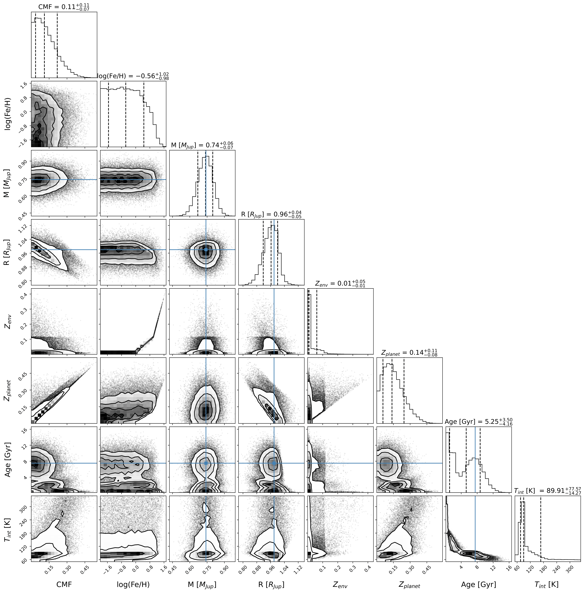

===================
Interior retrievals
===================

.. note::

   Download the full notebook : :download:`here </_static/retrieval.ipynb>`

In this page we show a tutorial on how to obtain a grid of GASTLI models to run a retrieval on mass, radius, age, and atmospheric metallicity.

We first need to generate a grid of forward models. The next example is going to consist of more than 4000 models. Each model takes between 2-10 second, so this may take up to 12 hours, depending on the computer architecture and number of threads/cores available for parallelization. Hence, we recommend setting up this step of the calculation in a cluster. The following code saves each thermal evolution curve in a file:

.. code-block:: python

   # Import coupling module
   import gastli.Thermal_evolution as therm
   # Other Python modules
   import numpy as np
   import os

   Mjup = 318.
   Rjup = 11.2
   ## Equilibrium temperature
   Teqpl = 842.
   # Input for interior
   ## mass in Mearth units
   mass = np.arange(0.4*Mjup,1.05*Mjup,0.05*Mjup)
   ## CMF
   CMFs = np.array([0.,0.1,0.2,0.25,0.3,0.35,0.4,0.45,0.5,0.6,0.8,0.99])
   ## log(Fe/H)
   log_FeHs = np.array([-2.,0.,1.,1.99])
   ## Tint
   Tint_array = np.array([50.,100.,200.,300.,400.,449.])
   # Loop for forward models
   n_mrel = len(CMFs)*len(log_FeHs)*len(mass)
   counter = 0
   for i_cmf, CMF in enumerate(CMFs):
       for i_FeH, logFeH in enumerate(log_FeHs):
           for i_mass, M_P in enumerate(mass):
               counter = counter+1
               # File with thermal evolution
               file_name = "Output/thermal_sequence_CMF_" + "{:4.2f}".format(CMF) + "_logFeH_" + "{:4.2f}".format(logFeH) +\
                         "_mass_" + "{:4.2f}".format(M_P) + ".dat"
               # Check that file does not exist to avoid overwrite
               answer = os.path.isfile(file_name)
               if answer == True:
                  continue
              # Print message to monitor progress
              print('---------------')
              print('CMF = ', CMF)
              print('log(Fe/H) = ', logFeH)
              print('Mass [Mearth] = ', M_P)
              print('Sequence = ', counter, ' out of ', n_mrel)
              print('---------------')
              # Thermal evolution class object
              my_therm_obj = therm.thermal_evolution(pow_law_formass=0.315)
              my_therm_obj.main(M_P, CMF, Teqpl, Tint_array, CO=0.55, log_FeH=logFeH)
              my_therm_obj.solve_thermal_evol_eq()
              # Save sequence of interior models
              data = np.zeros((len(my_therm_obj.f_S), 11))
              data[:, 0] = my_therm_obj.f_S
              data[:, 1] = my_therm_obj.s_mean_TE
              data[:, 2] = my_therm_obj.s_top_TE
              data[:, 3] = my_therm_obj.Tint_array
              data[:, 4] = my_therm_obj.Rtot_TE*Rjup
              data[:, 5] = my_therm_obj.Rbulk_TE*Rjup
              data[:, 6] = my_therm_obj.Tsurf_TE
              data[:, 7] = my_therm_obj.age_points
              data[:, 8] = my_therm_obj.Zenv_TE
              data[:, 9] = my_therm_obj.Mtot_TE
              tmm = CMF + (1-CMF)*my_therm_obj.Zenv_TE
              data[:, 10] = tmm
              header0 = 'f_S s_mean_TE s_top_TE Tint_K Rtot_earth Rbulk_earth Tsurf_K Age_Gyrs Zenv Mtot_earth Zplanet'
              np.savetxt(file_name, data, header=header0, comments='',fmt = '%1.4e')

Then, we can read all these files in a loop to generate a single hdf5 grid with all the forward models:

.. code-block:: python

   # Python modules
   import numpy as np
   import pandas as pd
   import h5py
   # Constants
   Mjup = 318.
   Rjup = 11.2
   # Arrays of grid
   ## mass in Mearth units
   masses = np.arange(0.4*Mjup,1.05*Mjup,0.05*Mjup)
   ## CMF
   CMFs = np.array([0.,0.1,0.2,0.25,0.3,0.35,0.4,0.45,0.5,0.6,0.8,0.99])
   ## log(Fe/H)
   log_FeHs = np.array([-2.,0.,1.,1.99])
   ## Tint
   Tint_array = np.array([50.,100.,200.,300.,349.])
   n_masses  = len(masses)
   n_logFeH = len(log_FeHs)
   n_CMF= len(CMFs)
   n_Tint = len(Tint_array)
   # Create file
   f = h5py.File("my_forward_model_grid.hdf5", "w")
   # Data sets
   data_set_Rtot = f.create_dataset("Rtot", (n_CMF, n_logFeH, n_masses, n_Tint), dtype='f')
   data_set_Rbulk = f.create_dataset("Rbulk", (n_CMF, n_logFeH, n_masses, n_Tint), dtype='f')
   data_set_age = f.create_dataset("age", (n_CMF, n_logFeH, n_masses, n_Tint), dtype='f')
   data_set_Tsurf = f.create_dataset("Tsurf", (n_CMF, n_logFeH, n_masses, n_Tint), dtype='f')
   data_set_Mtot = f.create_dataset("Mtot", (n_CMF, n_logFeH, n_masses, n_Tint), dtype='f')
   data_set_Zplanet = f.create_dataset("Zplanet", (n_CMF, n_logFeH, n_masses, n_Tint), dtype='f')
   data_set_Zenv = f.create_dataset("Zenv", (n_CMF, n_logFeH, n_masses, n_Tint), dtype='f')
   # Assign arrays for grid
   f['CMF'] = CMFs
   f['log_FeH'] = log_FeHs
   f['mass'] = masses/Mjup
   f['Tint'] = Tint_array
   # Prepare loop to read output files and fill in data sets
   n_mrel = n_CMF*n_logFeH*n_masses
   for i_cmf, CMF in enumerate(CMFs):
       for i_FeH, logFeH in enumerate(log_FeHs):
           for i_mass, M_P in enumerate(masses):
               file_name = "Output/thermal_sequence_CMF_" + "{:4.2f}".format(CMF) +\
                        "_logFeH_" + "{:4.2f}".format(logFeH) + "_mass_" + "{:4.2f}".format(M_P) + ".dat"
               # Read file
               data = pd.read_csv(file_name, sep='\s+', header=0)
               rtot = data['Rtot_earth']
               rbulk = data['Rbulk_earth']
               age = data['Age_Gyrs']
               tsurf = data['Tsurf_K']
               mtot = data['Mtot_earth']
               zplanet = data['Zplanet']
               zenv = data['Zenv']
               # Fill data set
               data_set_Rtot[i_cmf, i_FeH, i_mass, :] = rtot/Rjup
               data_set_Rbulk[i_cmf, i_FeH, i_mass, :] = rbulk/Rjup
               data_set_age[i_cmf, i_FeH, i_mass, :] = age
               data_set_Tsurf[i_cmf, i_FeH, i_mass, :] = tsurf
               data_set_Mtot[i_cmf, i_FeH, i_mass, :] = mtot/Mjup
               data_set_Zplanet[i_cmf, i_FeH, i_mass, :] = zplanet
               data_set_Zenv[i_cmf, i_FeH, i_mass, :] = zenv
   # End of loop, now attach dimensions to grid data sets
   ## Total radius (Jupiter units)
   f['Rtot'].dims[0].attach_scale(f['CMF'])
   f['Rtot'].dims[1].attach_scale(f['log_FeH'])
   f['Rtot'].dims[1].attach_scale(f['mass'])
   f['Rtot'].dims[1].attach_scale(f['Tint'])
   ## Interior radius 
   f['Rbulk'].dims[0].attach_scale(f['CMF'])
   f['Rbulk'].dims[1].attach_scale(f['log_FeH'])
   f['Rbulk'].dims[1].attach_scale(f['mass'])
   f['Rbulk'].dims[1].attach_scale(f['Tint'])
   ## Age (Gyrs)
   f['age'].dims[0].attach_scale(f['CMF'])
   f['age'].dims[1].attach_scale(f['log_FeH'])
   f['age'].dims[1].attach_scale(f['mass'])
   f['age'].dims[1].attach_scale(f['Tint'])
   ## Surface temperature (K)
   f['Tsurf'].dims[0].attach_scale(f['CMF'])
   f['Tsurf'].dims[1].attach_scale(f['log_FeH'])
   f['Tsurf'].dims[1].attach_scale(f['mass'])
   f['Tsurf'].dims[1].attach_scale(f['Tint'])
   ## Total mass (Jupiter units)
   f['Mtot'].dims[0].attach_scale(f['CMF'])
   f['Mtot'].dims[1].attach_scale(f['log_FeH'])
   f['Mtot'].dims[1].attach_scale(f['mass'])
   f['Mtot'].dims[1].attach_scale(f['Tint'])
   ## Total metal mass fraction
   f['Zplanet'].dims[0].attach_scale(f['CMF'])
   f['Zplanet'].dims[1].attach_scale(f['log_FeH'])
   f['Zplanet'].dims[1].attach_scale(f['mass'])
   f['Zplanet'].dims[1].attach_scale(f['Tint'])
   ## Envelope metal mass fraction
   f['Zenv'].dims[0].attach_scale(f['CMF'])
   f['Zenv'].dims[1].attach_scale(f['log_FeH'])
   f['Zenv'].dims[1].attach_scale(f['mass'])
   f['Zenv'].dims[1].attach_scale(f['Tint'])
   # Close file
   f.close()

We finally have our grid of forward models that we can interpolate. For the retrieval, you need to install the Markov chain Monte Carlo (MCMC) sampler package `emcee <https://emcee.readthedocs.io/en/stable/user/install/>`_. The following snippet uses ``emcee`` and interpolates our grid to perform the retrieval.

.. code-block:: python

   # import modules
   import numpy as np
   import h5py
   from scipy.interpolate import RegularGridInterpolator
   import matplotlib.pyplot as plt
   import emcee
   # Load data
   file_name = "my_forward_model_grid.hdf5"
   file = h5py.File(file_name, 'r')
   ## datasets
   data_set_Rtot = file['Rtot'][()]
   data_set_Rbulk = file['Rbulk'][()]
   data_set_age = file['age'][()]
   data_set_Tsurf = file['Tsurf'][()]
   data_set_Mtot = file['Mtot'][()]
   data_set_Zplanet = file['Zplanet'][()]
   data_set_Zenv = file['Zenv'][()]
   ## arrays
   CMFs = file['CMF'][()]
   logFeHs = file['log_FeH'][()]
   masses = file['mass'][()]
   Tints = file['Tint'][()]
   # Create functions for interpolation
   rtot = RegularGridInterpolator((CMFs,logFeHs,masses,Tints), data_set_Rtot, bounds_error=False, fill_value=None)
   rbulk = RegularGridInterpolator((CMFs,logFeHs,masses,Tints), data_set_Rbulk, bounds_error=False, fill_value=None)
   age = RegularGridInterpolator((CMFs,logFeHs,masses,Tints), data_set_age, bounds_error=False, fill_value=None)
   tsurf = RegularGridInterpolator((CMFs,logFeHs,masses,Tints), data_set_Tsurf, bounds_error=False, fill_value=None)
   mtot = RegularGridInterpolator((CMFs,logFeHs,masses,Tints), data_set_Mtot, bounds_error=False, fill_value=None)
   zplanet = RegularGridInterpolator((CMFs,logFeHs,masses,Tints), data_set_Zplanet, bounds_error=False, fill_value=None)
   zenv = RegularGridInterpolator((CMFs,logFeHs,masses,Tints), data_set_Zenv, bounds_error=False, fill_value=None)
   # Forward model function
   def forward_model(CMF, logFeH, bulk_mass, Tint_mod):
       '''
       Forward model
       '''
       pts = np.zeros((1, 4))
       pts[:, 0] = CMF
       pts[:, 1] = logFeH
       pts[:, 2] = bulk_mass
       pts[:, 3] = Tint_mod
       model_R = rtot(pts)
       R_mod = model_R[0]
       model_Mtot = mtot(pts)
       Mtot_mod = model_Mtot[0]
       model_age = age(pts)
       age_mod = model_age[0]
       return R_mod, Mtot_mod, age_mod
   # Example of use
   output_forward = forward_model(0.1, 0., 0.74, 70.)
   print(output_forward)
   # Log-likelihood
   ## Mass, radius and age: mean and uncertainties
   mean_mass = 0.74
   e_M_minus = 0.07
   e_M_plus = 0.06
   age_planet = 7.3
   e_age_minus = 2.5
   e_age_plus = 2.4
   mean_rad = 0.98
   e_rad_minus = 0.05
   e_rad_plus = 0.05
   x = np.asarray([])
   y = np.asarray([mean_mass,mean_rad,age_planet])
   yerr = np.asarray([e_M_plus,e_M_minus,e_rad_plus,e_rad_minus,e_age_plus,e_age_minus])
   '''
   Format:
   y = (Mp,Rp,age)
   yerr = (Mp_e+,Mp_e-,Rp_e+,Rp_e-,age_e+,age_e-)
   '''
   ## Function
   def log_likelihood(theta, x, y, yerr):
       CMF_mod, log_FeH_mod, mass_mod, Tint_mod = theta
       R_mod, Mtot_mod, age_mod  = forward_model(CMF_mod, log_FeH_mod, mass_mod, Tint_mod)
       Mdata = y[0]
       Rdata = y[1]
       age_data = y[2]
       sigma_Mplus = yerr[0]
       sigma_Mminus = yerr[1]
       sigma_Rplus = yerr[2]
       sigma_Rminus = yerr[3]
       sigma_age_plus = yerr[4]
       sigma_age_minus = yerr[5]
       if Mtot_mod > Mdata:
          sigma_M = sigma_Mplus
       else:
          sigma_M = sigma_Mminus
       if R_mod > Rdata:
          sigma_R = sigma_Rplus
       else:
          sigma_R = sigma_Rminus
       if age_mod > age_data:
          sigma_age = sigma_age_plus
       else:
          sigma_age = sigma_age_minus
       # Likelihood
       L = -0.5 * ( ((Mtot_mod - Mdata) / sigma_M) ** 2 + \
                 ((R_mod - Rdata) / sigma_R) ** 2+\
                 ((age_mod - age_planet) / sigma_age)**2 )
       return L
   # Example of use
   theta_test = np.array([0.1, 0., 0.74, 70.])
   a = log_likelihood(theta_test, x, y, yerr)
   print(a)
   # Priors
   ## Max and min limits
   CMF_min = 0.01
   CMF_max = 0.99
   logFeH_min = -2.
   logFeH_max = 1.99
   mass_min = 0.4
   mass_max = 1.05
   Tint_min = 50.
   Tint_max = 349.
   # Function
   def log_prior(theta):
       CMF_mod, log_FeH_mod, mass_mod, Tint_mod = theta
       if min(CMFs) < CMF_mod < max(CMFs) and \
       min(logFeHs) < log_FeH_mod < max(logFeHs) and \
       min(masses) < mass_mod < max(masses) and \
       Tint_min < Tint_mod < Tint_max:
           return 0.0
       return -np.inf
    # Probability function
    def log_probability(theta, x, y, yerr):
        lp = log_prior(theta)
        if not np.isfinite(lp):
           return -np.inf
        return lp + log_likelihood(theta, x, y, yerr)
    # Define walkers
    nwlk = 32
    pos = np.zeros((nwlk, 4))
    pos[:,0] = np.random.uniform(CMF_min, CMF_max, nwlk)                   # CMF: uniform
    pos[:,1] = np.random.uniform(logFeH_min, logFeH_max, nwlk)             # log(Fe/H): uniform
    pos[:,2] = np.random.normal(mean_mass, max(e_M_plus,e_M_minus), nwlk)  # mass: uniform
    pos[:,3] = np.random.uniform(Tint_min, Tint_max, nwlk)                 # Tint: log-uniform
    nwalkers, ndim = pos.shape
    # Define steps
    nsteps = int(100000)
    # emcee main functions
    sampler = emcee.EnsembleSampler(
    nwalkers, ndim, log_probability, args=(x, y, yerr), backend=backend
    )
    sampler.run_mcmc(pos, nsteps, progress=True)

A retrieval with this number of steps takes around 30 min. To check convergence, we can plot the evolution of the chains:

.. code-block:: python

   fig, axes = plt.subplots(ndim, figsize=(10, 11), sharex=True)
   samples = sampler.get_chain()
   labels = ["CMF", "log(FeH) [x solar]", "Mass [MJup]", "Tint [K]"]
   for i in range(ndim):
       ax = axes[i]
       ax.plot(samples[:, :, i], "k", alpha=0.3)
       ax.set_xlim(0, len(samples))
       ax.set_ylabel(labels[i])
       ax.yaxis.set_label_coords(-0.1, 0.5)
   axes[-1].set_xlabel("step number")
   fig.savefig('Output/emcee_convergence.pdf',bbox_inches='tight',format='pdf', dpi=1000)
   plt.close(fig)

    Positions of each walker as a function of the number of steps in the chain.

You can also check that the MCMC chains converged by looking at the autocorrelation time

.. code-block:: python

   tau = sampler.get_autocorr_time()
   print('tau = ', tau)

The autocorrelation time should not be larger than the number of steps divided by 50.

We can obtain the samples and save them with: 

.. code-block:: python

   # Obtain input parameter samples
   ndiscard = int(2 * max(tau))
   nthin = int(max(tau)/2)
   flat_samples = sampler.get_chain(discard=ndiscard, thin=nthin, flat=True)
   n = flat_samples.shape[0]
   CMF_sample = flat_samples[:, 0]
   logFeH_sample = flat_samples[:, 1]
   mass_sample = flat_samples[:, 2]
   tint_sample = flat_samples[:, 3]
   # Output parameter
   ## Initialise arrays
   rtot_sample = np.zeros_like(CMF_sample)
   mtot_sample = np.zeros_like(CMF_sample)
   rbulk_sample = np.zeros_like(CMF_sample)
   age_sample = np.zeros_like(CMF_sample)
   tsurf_sample = np.zeros_like(CMF_sample)
   zplanet_sample = np.zeros_like(CMF_sample)
   zenv_sample = np.zeros_like(CMF_sample)
   ## Interpolate 
   pts = np.zeros((n, 4))
   pts[:, 0] = CMF_sample
   pts[:, 1] = logFeH_sample
   pts[:, 2] = mass_sample
   pts[:, 3] = tint_sample
   rtot_sample = rtot(pts)
   mtot_sample = mtot(pts)
   rbulk_sample = rbulk(pts)
   age_sample = age(pts)
   tsurf_sample = tsurf(pts)
   zplanet_sample = zplanet(pts)
   zenv_sample = zenv(pts)
   # Save all samples in output file
   data = np.zeros((n,11))
   data[:,0] = CMF_sample
   data[:,1] = logFeH_sample
   data[:,2] = mass_sample
   data[:,3] = age_sample
   data[:,4] = rtot_sample
   data[:,5] = mtot_sample
   data[:,6] = rbulk_sample
   data[:,7] = tint_sample
   data[:,8] = tsurf_sample
   data[:,9] = zplanet_sample
   data[:,10] = zenv_sample
   np.savetxt('samples.dat', data,\
           header='CMF logFeH Mbulk[M_J] Age[Gyr] Rtot[R_J] Mtot[M_J] Rbulk[R_J] Tint[K] Tsurf[K] Zpl Zenv',\
           comments='',fmt='%1.4e')

Finally, we can generate a corner plot with the samples with the module ``corner`` (see how to install it `here <https://corner.readthedocs.io/en/latest/install/>`_). Here is a snippet to plot the samples obtained above:

.. code-block:: python

   # python modules
   import pandas as pd
   import numpy as np
   import corner
   # Read samples file
   data = pd.read_csv('samples.dat', sep='\s+')
   CMF = data['CMF']
   log_FeH = data['logFeH']
   M = data['Mtot[M_J]']
   R = data['Rtot[R_J]']
   Mbulk = data['Mbulk[M_J]']
   Zenv = data['Zenv']
   age = data['Age[Gyr]']
   Tint = data['Tint[K]']
   # Account for atmospheric mass (this is usually negligible)
   Matm = M - Mbulk
   Menv_int = Mbulk * (1-CMF)
   EMF_recalc = (Menv_int + Matm)/M
   x_core = 1. - EMF_recalc
   Zplanet = x_core + EMF_recalc*Zenv
   # Corner input
   flat_samples = np.zeros((len(CMF),8))
   flat_samples[:,0] = CMF
   flat_samples[:,1] = log_FeH
   flat_samples[:,2] = M
   flat_samples[:,3] = R
   flat_samples[:,4] = Zenv
   flat_samples[:,5] = Zplanet
   flat_samples[:,6] = age
   flat_samples[:,7] = Tint
   # Plot it.
   figure = corner.corner(flat_samples, labels=[r"CMF", r"log(Fe/H)", r"M [$M_{Jup}$]",\
                                             r"R [$R_{Jup}$]", "$Z_{env}$", r"$Z_{planet}$", r"Age [Gyr]",\
                                             r"$T_{int}$ [K] "],
                       quantiles=[0.16, 0.5, 0.84],\
                       truths=[np.nan,np.nan,0.74,0.98,np.nan,np.nan,7.5,np.nan],\
                       show_titles=True, title_kwargs={"fontsize": 14},label_kwargs={"fontsize": 16})
   figure.savefig('corner_plot.pdf',bbox_inches='tight',format='pdf', dpi=1000)

    Corner plot of our retrieval with GASTLI

   

   

    

  

