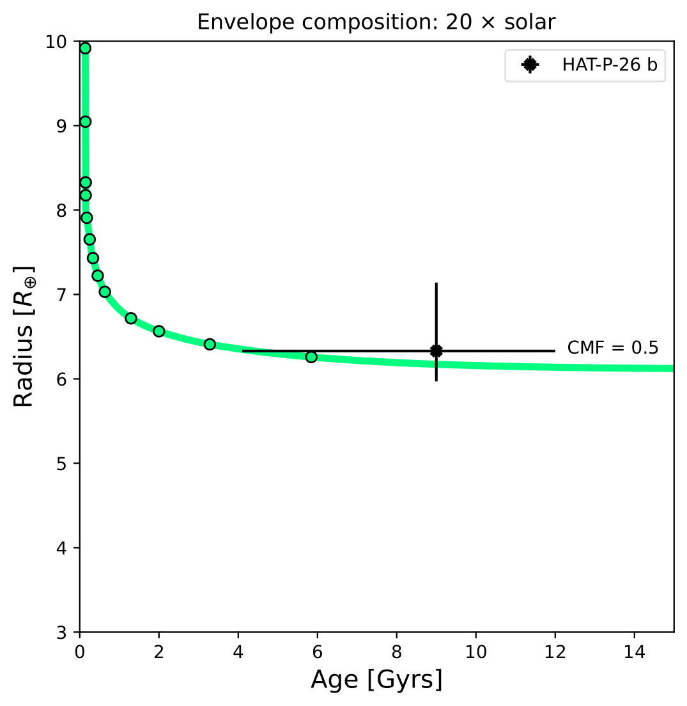
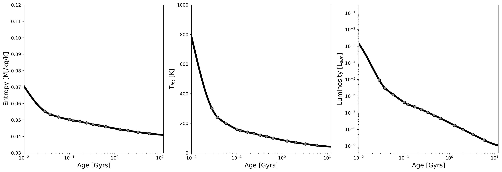

Generating a thermal evolution curve
=========================================

.. note::

   Download the full notebook : :download:`here </_static/thermal_evol.ipynb>`

To obtain the internal temperature (or luminosity) and radius as a function of age, we need to use the GASTLI class ``Thermal_evolution``. This class obtains a sequence of static interior-atmosphere models at different internal temperatures with the function ``thermal_evolution_class_object.main()``. The input array ``Tint_array`` specifies the discreet internal temperatures at which the static models are computed. We recommend to save the sequence of interior models in a file, as in the example below. In this example, we name the thermal evolution class object ``my_therm_obj``. The output of the ``main()`` thermal class function is:

- The derivative of the entropy **dS/dt** in SI units: ``thermal_evolution_class_object.f_S``
- The envelope **entropy at 1000 bar** in J/kg/K: ``thermal_evolution_class_object.s_top_TE``
- The envelope mean entropy in J/kg/K: ``thermal_evolution_class_object.s_mean_TE``
- The **total planet radius**, and interior radius (center to surface pressure) in Jupiter radii: ``thermal_evolution_class_object.Rtot_TE`` and ``thermal_evolution_class_object.Rbulk_TE``
- The surface temperature in K: ``thermal_evolution_class_object.Tsurf_TE``

.. code-block:: python

   # Import GASTLI thermal module
   import gastli.Thermal_evolution as therm
   # Other Python modules
   import numpy as np
   # Create thermal evolution class object
   my_therm_obj = therm.thermal_evolution()
   # Input for interior
   M_P = 18.76     # Earth units
   # Equilibrium temperatures
   Teqpl = 1000.
   # Core mass fraction
   CMF = 0.5
   log_FeH = np.log10(20.) # 20 x solar
   Tint_array = np.asarray([50.,60.,70.,80., 100., 110., 120., 130., 140., 160., 150., 160., 200., 240., 300.])
   # Run sequence of interior models at different internal temperatures
   my_therm_obj.main(M_P, CMF, Teqpl, Tint_array, log_FeH=log_FeH)
   # Recommended: save sequence of interior models in case thermal evol eq. solver stops
   Rjup = 11.2  # Jupiter radius in Earth units
   data = np.zeros((len(my_therm_obj.f_S),7))
   data[:,0] = my_therm_obj.f_S
   data[:,1] = my_therm_obj.s_mean_TE
   data[:,2] = my_therm_obj.s_top_TE
   data[:,3] = my_therm_obj.Tint_array
   data[:,4] = my_therm_obj.Rtot_TE*Rjup
   data[:,5] = my_therm_obj.Rbulk_TE*Rjup
   data[:,6] = my_therm_obj.Tsurf_TE*Rjup
   fmt = '%1.4e','%1.4e','%1.4e','%1.4e','%1.4e','%1.4e','%1.4e'
   np.savetxt('thermal_sequence_HATP26b_CMF50_20xsolar.dat', data,header='f_S s_mean_TE s_top_TE Tint Rtot Rbulk    Tsurf',comments='',fmt=fmt)

Then this file can be read, and its columns are used to solve the luminosity differential equation by the function ``thermal_evolution_class_object.solve_thermal_evol_eq()``. This function requires an age array in Gyr to solve the luminosity equation, ``t_Gyr``. The default contains 100 points for fast computations, but for thermal evolution curves with ages younger than 1 Gyr, we recommend to use 10000 points, as in the example below. The final output is the corresponding radius array ``thermal_evolution_class_object.Rtot_solution``. The array ``thermal_evolution_class_object.age_points`` contains the age evaluated at the static interior models. 

.. code-block:: python

   # Import GASTLI thermal module
   import gastli.Thermal_evolution as therm
   # Other Python modules
   import numpy as np
   import matplotlib.pyplot as plt
   from scipy import interpolate
   import pandas as pd
   # Create thermal evolution class
   my_therm_obj = therm.thermal_evolution()
   # Read in data saved in step 1
   data = pd.read_csv('thermal_sequence_HATP26b_CMF50_20xsolar.dat', sep='\s+',header=None,skiprows=1)
   my_therm_obj.f_S = data[0]
   my_therm_obj.s_mean_TE = data[1]
   my_therm_obj.s_top_TE = data[2]
   my_therm_obj.Tint_array = data[3]
   my_therm_obj.Rtot_TE = data[4]
   my_therm_obj.Rbulk_TE = data[5]
   my_therm_obj.Tsurf_TE = data[6]
   my_therm_obj.solve_thermal_evol_eq(t_Gyr=np.linspace(2.1e-6, 15., 10000))
   # Plot thermal evolution
   fig = plt.figure(figsize=(6, 6))
   ax = fig.add_subplot(1, 1, 1)
   plt.title(r"Envelope composition: 20 $\times$ solar")
   plt.plot(my_therm_obj.t_Gyr, my_therm_obj.Rtot_solution, '-', color='springgreen', linewidth=4.) #,label="CMF = 0.9")
   plt.plot(my_therm_obj.age_points, my_therm_obj.Rtot_TE, 'o', color='springgreen', markeredgecolor='k')
   plt.text(12.3,6.3,"CMF = 0.5")
   # HAT-P-26 b radius and age data
   yerr = np.zeros((2,1))
   yerr[0,0] = 0.36
   yerr[1,0] = 0.81
   xerr = np.zeros((2,1))
   xerr[0,0] = 4.9
   xerr[1,0] = 3.
   plt.errorbar([9.],[6.33], yerr, xerr,'X',color='black',label="HAT-P-26 b")
   plt.legend()
   plt.ylabel(r'Radius [$R_{\oplus}$]', fontsize=14)
   plt.xlabel(r'Age [Gyrs]', fontsize=14)
   plt.xlim(0.,15.)
   plt.ylim(3.,10.)
   # Save figure
   fig.savefig('thermal_evolution_HATP26b_20xsolar.pdf', bbox_inches='tight', format='pdf', dpi=1000)
   plt.close(fig)

   Radius evolution of HAT-P-26 b for CMF = 0.5 and 20 x solar envelope composition.

The output arrays ``thermal_evolution_class_object.Tint_solution`` and ``thermal_evolution_class_object.S_solution`` can be used to plot the internal temperature and luminosity, and the entropy, respectively:

.. code-block:: python

   # Plot thermal evolution
   fig = plt.figure(figsize=(19, 6))
   # Entropy
   ax = fig.add_subplot(1, 3, 1)
   plt.plot(my_therm_obj.t_Gyr, my_therm_obj.S_solution/1e6, linestyle='solid', color='black',linewidth=4)
   plt.plot(my_therm_obj.age_points, my_therm_obj.s_top_TE/1e6, 'o', color='grey', markeredgecolor='k')
   plt.ylabel(r'Entropy [MJ/kg/K]', fontsize=14)
   plt.xlabel(r'Age [Gyrs]', fontsize=14)
   ax.set_xscale('log')
   plt.xlim(1e-2,12.)
   plt.ylim(0.03,0.12)
   plt.legend()
   # Internal (or intrinsic) temperature
   ax = fig.add_subplot(1, 3, 2)
   plt.plot(my_therm_obj.t_Gyr, my_therm_obj.Tint_solution, linestyle='solid', color='black',linewidth=4)
   plt.plot(my_therm_obj.age_points, my_therm_obj.Tint_array, 'o', color='grey', markeredgecolor='k')
   plt.ylabel(r'T$_{int}$ [K]', fontsize=14)
   plt.xlabel(r'Age [Gyrs]', fontsize=14)
   ax.set_xscale('log')
   plt.xlim(1e-2,12.)
   plt.ylim(0.,1000)
   # Luminosity
   ax = fig.add_subplot(1, 3, 3)
   sigma = 5.67e-8
   Lsun = 3.846e26
   Lint = (4 * np.pi * sigma * (my_therm_obj.Rtot_TE*11.2*cte.constants.r_e)**2 * my_therm_obj.Tint_array**4)/Lsun
   Lsolution = (4 * np.pi * sigma * (my_therm_obj.Rtot_solution*11.2*cte.constants.r_e)**2 *\
             my_therm_obj.Tint_solution**4)/Lsun
   plt.plot(my_therm_obj.t_Gyr, Lsolution, linestyle='solid', color='black',linewidth=4)
   plt.plot(my_therm_obj.age_points, Lint, 'o', color='grey', markeredgecolor='k')
   plt.ylabel(r'Luminosity [L$_{sun}$]', fontsize=14)
   plt.xlabel(r'Age [Gyrs]', fontsize=14)
   ax.set_yscale('log')
   ax.set_xscale('log')
   plt.xlim(1e-2,12.)
   # Save plot
   fig.savefig('thermal_evolution_all.pdf', bbox_inches='tight', format='pdf', dpi=1000)
   plt.close(fig)

   Entropy, internal temperature, and luminosity of HAT-P-26 b for CMF = 0.5 and 20 x solar envelope composition.

